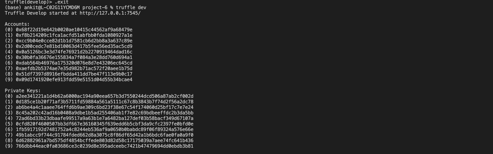

## Project Write-Up

### UML diagrams

#### Activity Diagram

#### Sequence Diagram

#### State Diagram

#### Class Diagram

## IPFS Usage
None
## Test cases 

#### Local Network

#### Tests
(diagrams/test_cases.jpeg)

## UI

SupplyChain contract has been deployed to Rinkeby test network. Details of deployment:
* **transaction:** https://rinkeby.etherscan.io/tx/0xc286875cfc3bca08f0041797e352c1dbaf94a5635b8cb9200616bd645be35a2b
* **contract address:** https://rinkeby.etherscan.io/address/0xe9AE90f5550199847D059f1F8598C0dD2eE976b0

## Additional comments

In development the following versions were used:
* node - 17.8.0
* npm - 8.5.5
* truffle - 5.5.3
* Solidity - 0.5.6
